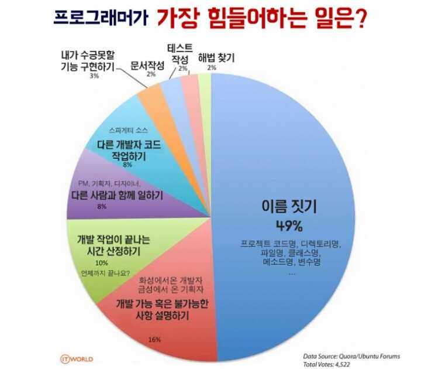
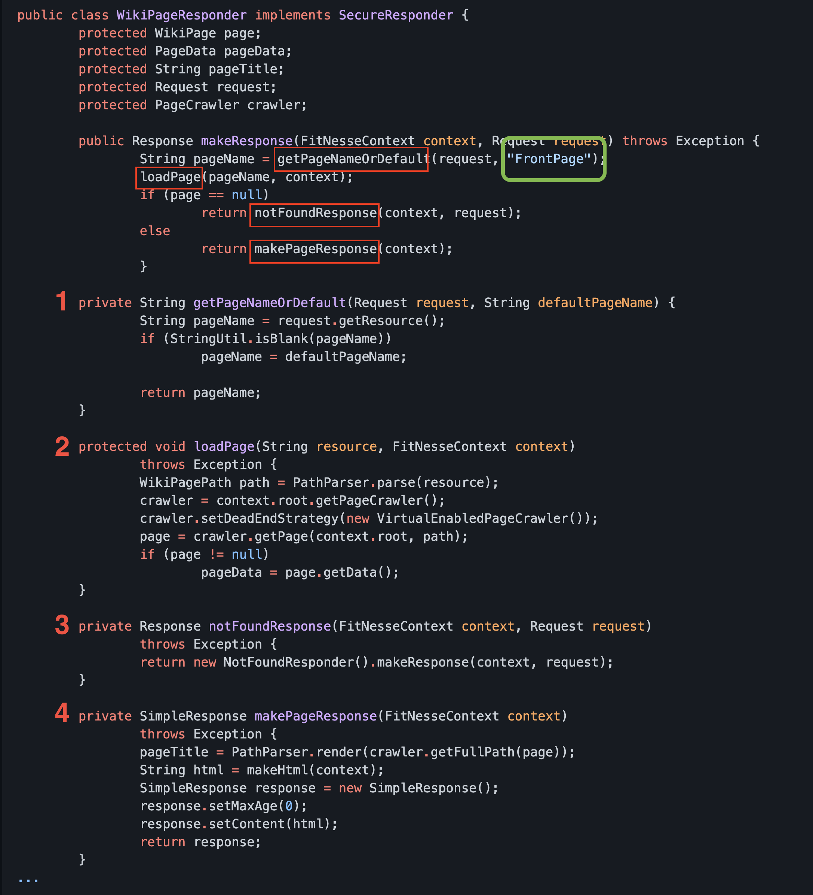
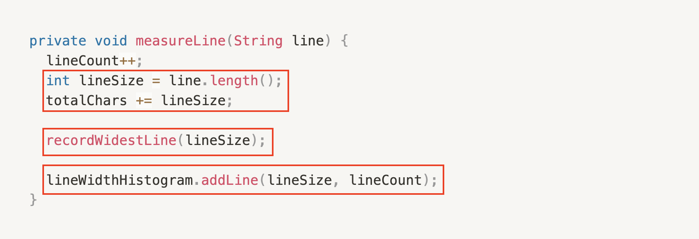
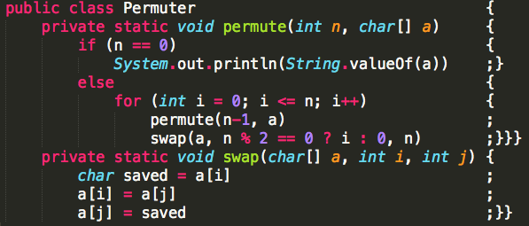

# 클린 코드 스터디 발표자료

# Chapter 5. 형식 맞추기

발표자: 렉시안(김진혁) ⭐️
노션으로 보기: https://humble-nitrogen-3b9.notion.site/3778382b77f84f5287d6fdd7dcc0531d

## **목차**

1. 형식을 맞추는 목적
2. 세로 형식 맞추기 ↕️
3. 가로 형식 맞추기 ↔️
4. 들여쓰기
5. 팀 규칙

---

## **1. 형식을 맞추는 목적**

**코드 형식은 중요하다**⚠️

코드 형식은 의사소통의 일환이다. 의사소통은 전문 개발자의 일차적인 의무이다. 어쩌면 '동작하는 코드'가 전문 개발자의 일차적인 의무라 여길지도 모르겠지만 이 책을 읽으면서 생각이 바뀌었기를 바란다는 필자의 의견.

> 오늘 구현한 코드의 가독성은 앞으로 바뀔 코드의 품질에 지대한 영향을 미친다.

오랜시간이 지나 원래 코드의 흔적을 더 이상 찾아보기 어려울 정도로 코드가 바뀌어도 맨 처음 잡아놓은 구현스타일과 가독성 수준은 **유지보수 용이성과 확장성에 계속 영향을 미친다. 원래 코드는 사라질지라도 개발자의 스타일과 규율은 사라지지 않는다. 따라서**

- **프로그래머라면 형식을 깔끔하게 맞춰 코드를 짜야 한다.**
- **코드 형식을 맞추기 위해 간단한 규칙을 정하고, 그 규칙을 착실히 따라야 한다.**
- **팀으로 일한다면 팀이 합의해 규칙을 정하고, 모두가 그 규칙을 따라야 한다. 필요하다면 규칙을 자동으로 적용하는 도구🛠를 활용한다.**

**그렇다면 원활한 소통을 장려하는 코드 형식은 무엇일까?**

## **2. 세로 형식 맞추기 ↕️**

### **적절한 행 길이를 유지하라(feat. 신문기사 📝)**

**아주 좋은 신문 기사를 떠올려보자. 독자는 위에서 아래로 기사를 읽는다.**

**최상단에는 기사를 몇 마디로 요약하는 표제가 나온다. 독자는 표제를 보고서 기사를 읽을지 말지 결정한다. 첫 문단은 전체 기사 내용을 요약한다. 세세한 사실은 숨기고 커다란 그림을 보여준다. 쭉 읽으며 내려가면 세세한 사실이 조금씩 드러난다. 날짜, 이름, 발언, 주장, 기타 세부사항이 나온다.**

**소스 파일도 신문기사와 비슷하게 작성한다. 이름은 간단하면서도 설명이 가능하게 짓는다. 이름만 보고도 올바른 모듈을 살펴보고 있는지 아닌지를 판단할 정도로 신경 써서 짓는다. 소스 파일의 첫 부분은 고차원 개념과 알고리즘을 설명한다. 아래로 내려갈수록 의도를 세세하게 묘사한다. 마지막에는 가장 저차원함수와 세부 내역이 나온다.**



**신문은 다양한 기사로 이루어져 있으며, 어떤 기사는 조금 길지만 대다수 기사가 아주 짧다. 신문이 읽을 만한 이유는 여기에 있다. 신문이 사실, 날짜, 이름 등을 무작위로 뒤섞은 긴 기사 하나만 싣는다면 아무도 읽지 않을 것이다.**

### **개념은 빈 행으로 분리하라**

**거의 모든 코드는 왼쪽에서 오른쪽으로➡️, 그리고 위에서 아래로⬇️ 읽힌다. 각 행은 수식이나 절을 나타내고, 일련의 행 묶음은 완결된 생각 하나를 표현한다. 생각 사이는 빈 행을 넣어 분리해야 마땅하다. 빈 행은 새로운 개념을 시작한다는 시각적 단서이다.**

```java
// 빈 행을 넣지 않을 경우
package fitnesse.wikitext.widgets;
import java.util.regex.*;
public class BoldWidget extends ParentWidget {
	public static final String REGEXP = "'''.+?'''";
	private static final Pattern pattern = Pattern.compile("'''(.+?)'''",
		Pattern.MULTILINE + Pattern.DOTALL);
	public BoldWidget(ParentWidget parent, String text) throws Exception {
		super(parent);
		Matcher match = pattern.matcher(text); match.find(); 
		addChildWidgets(match.group(1));}
	public String render() throws Exception { 
		StringBuffer html = new StringBuffer("<b>"); 		
		html.append(childHtml()).append("</b>"); 
		return html.toString();
	} 
}
```

```java
// 빈 행을 넣을 경우
package fitnesse.wikitext.widgets;

import java.util.regex.*;

public class BoldWidget extends ParentWidget {
	public static final String REGEXP = "'''.+?'''";
	private static final Pattern pattern = Pattern.compile("'''(.+?)'''", 
		Pattern.MULTILINE + Pattern.DOTALL
	);
	
	public BoldWidget(ParentWidget parent, String text) throws Exception { 
		super(parent);
		Matcher match = pattern.matcher(text);
		match.find();
		addChildWidgets(match.group(1)); 
	}
	
	public String render() throws Exception { 
		StringBuffer html = new StringBuffer("<b>"); 
		html.append(childHtml()).append("</b>"); 
		return html.toString();
	} 
}
```

### 세로 밀집도

세로 밀집도는 **연관성을 의미**한다. 즉, 서로 밀접한 코드 행은 세로로 가까이 놓여야 한다는 뜻이다. 

### 수직 거리

함수 연관 관계와 동작 방식을 이해하려고 이 함수에서 저 함수로 오가며 소스 파일을 위아래로 뒤지는 등 뺑뺑이를 돌았으나 결국은 미로 같은 코드 때문에 혼란만 가중된 경험이 있는가? ~~그럼요~~

서로 밀접한 두 개념은 세로 거리로 연관성을 표현한다.

이게 바로 protected 변수를 피해야 하는 이유 중 하나이다.

- Protected 변수를 피해야 하는 이유

    상속과 관련된 문제라고 볼 수 있음.  protected로 접근 지정을 하는 이유가 하위 클래스에서 접근이 가능하게 하려고 하는 건데, 밀접한 개념의 변수를 한 파일에 넣지 않고 파일을 분리한 후 protected를 사용하는 것은 결**국 밀접한 개념을 다른 파일로 분리시키는 것과** 다름없기 때문이다. protected를 사용하면 파일의 코드 수를 줄여주기만 할 뿐, 좋지 않은 설계라고 볼 수 있다.

```java
// 의미없는 주석으로 변수를 떨어뜨려 놓아서 한눈에 파악이 잘 안된다.

public class ReporterConfig {
	/**
	* The class name of the reporter listener 
	*/
	private String m_className;
	
	/**
	* The properties of the reporter listener 
	*/
	private List<Property> m_properties = new ArrayList<Property>();
	public void addProperty(Property property) { 
		m_properties.add(property);
	}
```

```java
// 의미 없는 주석을 제거함으로써 코드가 한눈에 들어온다.
// 변수 2개에 메소드가 1개인 클래스라는 사실이 드러난다.

public class ReporterConfig {
	private String m_className;
	private List<Property> m_properties = new ArrayList<Property>();
	
	public void addProperty(Property property) { 
		m_properties.add(property);
	}
```

### 변수 선언

변수는 사용하는 위치에 최대한 가까이 선언한다. 

```java
// InputStream이 함수 맨 처음에 선언
private static void readPreferences() {
	InputStream is = null;
	try {
		is = new FileInputStream(getPreferencesFile()); 
		setPreferences(new Properties(getPreferences())); 
		getPreferences().load(is);
	} catch (IOException e) { 
		try {
			if (is != null) 
				is.close();
		} catch (IOException e1) {
		} 
	}
}

// 루프 제어 변수는 루프 문 내부에 선언
public int countTestCases() { 
	int count = 0;
	for (Test each : tests)
		count += each.countTestCases(); 
	return count;
}
```

### 인스턴스 변수

인스턴스 변수는 클래스 맨 처음에 선언한다. 또한 변수 간에 세로로 거리를 두지 않는다. 잘 설계한 클래스는 많은 클래스 메서드가 인스턴스 변수를 사용하기 때문이다.

인스턴스 변수를 선언하는 위치는 아직도 논쟁이 분분하다. C++에서는 인스턴스 변수를 클래스 마지막에 선언한다는 소위 가위 규칙(Scissors rule)을 적용한다. 하지만 자바에서는 보통 클래스 맨 처음에 인스턴스 변수를 선언한다. 

위치보다는 잘 알려진 위치에 인스턴스 변수를 모은다는 사실이 **중요**하다.

```java
public class TestSuite implements Test {
	static public Test createTest(Class<? extends TestCase> theClass,
									String name) {
		... 
	}

	public static Constructor<? extends TestCase> 
	getTestConstructor(Class<? extends TestCase> theClass) 
	throws NoSuchMethodException {
		... 
	}

	public static Test warning(final String message) { 
		...
	}
	
	private static String exceptionToString(Throwable t) { 
		...
	}
	
	private String fName; // NOT THIS 🙅‍♂️

	private Vector<Test> fTests= new Vector<Test>(10);

	public TestSuite() { }
	
	public TestSuite(final Class<? extends TestCase> theClass) { 
		...
	}

	public TestSuite(Class<? extends TestCase> theClass, String name) { 
		...
	}
	
	... ... ... ... ...
}
```

### 종속 함수

한 함수가 다른 함수를 호출한다면 두 함수는 세로로 가까이 배치한다. 또한 가능하다면 호출하는 함수를 호출되는 함수보다 먼저 배치한다. 그러면 프로그램이 자연스럽게 읽힌다. (신문기사를 다시 생각해보자) 자연스럽게 모듈 전체의 가독성도 높아진다.



또한 위 코드는 상수를 적절한 수준에 두는 좋은 예제이다. `getPageNameOrDefault` 함수 안에서 "FrontPage" 상수를 사용할 수도 있다. 하지만 그러면 기대와는 달리 잘 알려진 상수가 적절하지 않은 저차원 함수에 묻힌다. 

상수를 알아야 마땅한 함수에서 실제로 사용하는 함수로 상수는 넘겨주는 방법이 더 좋다.

### 개념의 유사성

개념적인 친화도가 높을 수록 코드를 가까이 배치한다. 

```java
public class Assert {
    static public void assertTrue(String message, boolean condition) {
        if (!condition)
            fail(message);
    }

    static public void assertTrue(boolean condition) {
        assertTrue(null, condition);
    }

    static public void assertFalse(String message, boolean condition) {
        assertTrue(message, !condition);
    }

    static public void assertFalse(boolean condition) {
        assertFalse(null, condition);
    }
}
```

### 🔴 정리

함수 호출 종속성은 아래 방향으로 유지한다.

신문기사와 마찬가지로 가장 중요한 개념을 가장 먼저 표현한다. 

소스 코드 모듈이 고차원에서 저차원으로 자연스럽게 내려가도록 유지한다.

## **3. 가로 형식 맞추기 ↔️**

한 행은 가로로 얼마나 길어야 적당할까? 저자가 대표적으로 조사한 7개의 프로젝트를 보면 20자에서 60자 사이인 행이 모든 코드의 40%에 달했다. 10자 미만은 30%정도로 보인다. 80자 이후부터 행 수는 급격하게 감소한다. 이를 통해 프로그래머는 명백하게 짧은 행을 선호한다는 것을 알 수 있다.

저자는 홀러리스(Hollerith)가 내놓은 80자 제한은 다소 인위적이며 100자나 120자에 달해도 나쁘지 않다고 한다. 하지만 그 이상은 ~~살려줘~~ 솔직히 주의부족이라고 한다.

```python
# 프로그래머스 - 두 개 뽑아서 더하기
# 한눈에 알아보기 굉장히 힘들다.
def solution(numbers):
    return sorted(list(set([numbers[i] + numbers[j] for i in range(len(numbers) - 1) for j in range(i + 1, len(numbers))])))

# 더 나아가면
solution = lambda numbers : sorted(list(set([numbers[i] + numbers[j] for i in range(len(numbers) - 1) for j in range(i + 1, len(numbers))])))
```

### 가로 공백과 밀집도

가로로는 공백을 사용해 밀접한 개념과 느슨한 개념을 표현한다. 



위 코드를 보면 할당 연산자를 강조하기 위해 앞뒤에 공백을 줬다. 반면 함수 이름과 이어지는 괄호 사이에는 공백을 넣지 않았다. 함수와 인수는 서로 밀접하기 때문이다. 공백을 넣으면 한 개념이 아니라 별개로 보인다. 함수를 호출하는 코드에서 괄호 안 인수는 공백으로 분리했다. 쉼표를 강조해 인수가 별개라는 사실을 보여주기 위해서다.

### 가로 공백

저자는 어셈블리어 프로그래머였던 시절에 특정 구조를 강조하고자 가로 정렬을 사용했다. 나중에 C, C++, Java로 프로그램을 짜면서도 선언부의 변수 이름이나 할당문의 오른쪽 피연산자를 빠뜨리지 않고 나란히 정렬했다. 대략 다음과 같은 모습이었다. ~~상당히 피곤한 스타일이셨다는 걸 알 수 있다~~

```java
public class FitNesseExpediter implements ResponseSender {
	private		Socket		        socket;
	private 	InputStream 	    input;
	private 	OutputStream 	    output;
	private 	Reques		        request; 		
	private 	Response 	        response;	
	private 	FitNesseContex	  context; 
	protected long		          requestParsingTimeLimit;
	private 	long		          requestProgress;
	private 	long		          requestParsingDeadline;
	private 	boolean		        hasError;
	
	...
```

하지만 저자는 위와 같은 정렬이 별로 유용하지 못하다는 사실을 깨달았다. 코드가 엉뚱한 부분을 강조해 진짜 의도가 가려지기 때문이다. 위 선언부를 읽다보면 변수 유형은 무시하고 변수 이름부터 읽게 된다.

 ~~그리고 보통 Code Formatter가 원상복구 시켜버린다~~

선언문과 할당문을 별도로 정렬할 필요는 없다! 

### 🔴 정리

- 가로 길이는 100~120자를 넘지 않도록 관리하자
- 연산자의 강조와 함수와 인수사이는 공백으로 강조유무를 표시하자
- 가로 공백이 필요할 정도로 목록이 길다는 문제는 **목록 길이**가 문제이지 정렬 부족이 아니다

## **4. 들여쓰기(Indentation)**

범위로 이루어진 계층을 표현하기 위 해 우리는 코드를 들여쓴다. 들여쓰는 계층에서 코드가 자리 잡은 수준에 비례한다.

1. 파일 수준인 문장은 들여쓰지 않는다
2. 클래스 내 메서드는 클래스보다 한 수준 들여쓴다
3. 메서드 코드는 메서드 선언보다 한 수준 들여쓴다
4. 블록 코드는 블록을 포함하는 코드보다 한 수준 들여쓴다

프로그래머는 이런 들여쓰기 체계에 크게 의존한다. 왼쪽으로 코드를 맞춰 코드가 속하는 범위를 시각적으로 표현한다. 그러면 이 범위에서 저 범위로 재빨리 이동하기 쉬워진다. 들여쓰기가 없다면 인간이 코드를 읽기란 거의 불가능할 것이다. 아래의 두 코드는 완벽하게 동일한 내용이다.

```java
public class BoldWidget extends ParentWidget { public static final String REGEXP =
"'''.+?'''"; private static final Pattern pattern = Pattern.compile("'''(.+?)'''", 
Pattern.MULTILINE + Pattern.DOTALL); public BoldWidget(ParentWidget parent, 
String text) throws Exception { super(parent); Matcher match = pattern.matcher(text);
match.find(); addChildWidgets(match.group(1));} public String render() throws Exception { 
StringBuffer html = new StringBuffer("<b>"); html.append(childHtml()).append("</b>"); 
return html.toString();}}
```

```java
public class BoldWidget extends ParentWidget {
	public static final String REGEXP = "'''.+?'''";
	private static final Pattern pattern = Pattern.compile("'''(.+?)'''", 
		Pattern.MULTILINE + Pattern.DOTALL
	);
	
	public BoldWidget(ParentWidget parent, String text) throws Exception { 
		super(parent);
		Matcher match = pattern.matcher(text);
		match.find();
		addChildWidgets(match.group(1)); 
	}
	
	public String render() throws Exception { 
		StringBuffer html = new StringBuffer("<b>"); 
		html.append(childHtml()).append("</b>"); 
		return html.toString();
	} 
}
```

### 들여쓰기 무시하기

때로는 간단한 if문, 짧은 while 문, 짧은 함수에서 들여쓰기 규칙을 무시하고픈 유혹이 생긴다. 하지만 한 행에 범위를 뭉뚱그린 코드를 피해야 한다고 한다.

```java
// NOT THIS 💩
public class CommentWidget extends TextWidget {
	public static final String REGEXP = "^#[^\r\n]*(?:(?:\r\n)|\n|\r)?";
	
	public CommentWidget(ParentWidget parent, String text){super(parent, text);}
	public String render() throws Exception {return ""; } 
}

// THIS 👍
public class CommentWidget extends TextWidget {
	public static final String REGEXP = "^#[^\r\n]*(?:(?:\r\n)|\n|\r)?";
	
	public CommentWidget(ParentWidget parent, String text){
		super(parent, text);
	}
	
	public String render() throws Exception {
		return ""; 
	} 
}
```

짤방: 자바를 파이써닉하게 쓰고 싶었던 개발자 



## **5. 팀 규칙**

프로그래머라면 각자 선호하는 규칙이 있다. 하지만 팀에 속한다면 자신이 선호해야 할 규칙은 바로 팀 규칙이다. 팀은 한 가지 규칙에 합의해야 한다. 그리고 모든 팀원은 그 규칙을 따라야 한다. 그래야 소프트웨어가 일관적인 스타일을 보인다. 합의해야 할 규칙은 대략

- 어디에 괄호를 넣을지
- 들여쓰기는 몇자로 할지
- 클래스와 변수와 메서드 이름은 어떻게 지을지

좋은 소프트웨어 시스템은 **읽기 쉬운 문서📕로 이뤄진다**는 사실을 기억하자!
