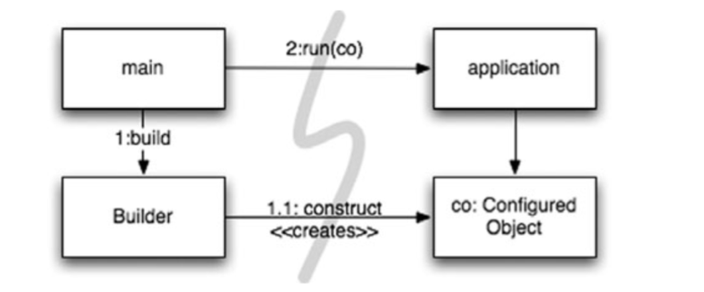
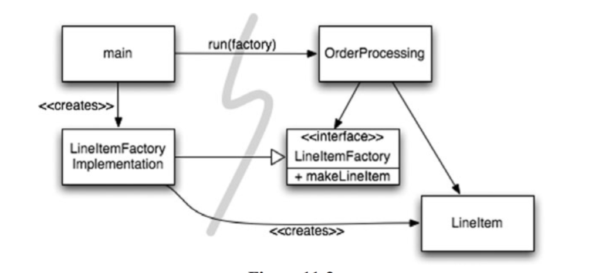
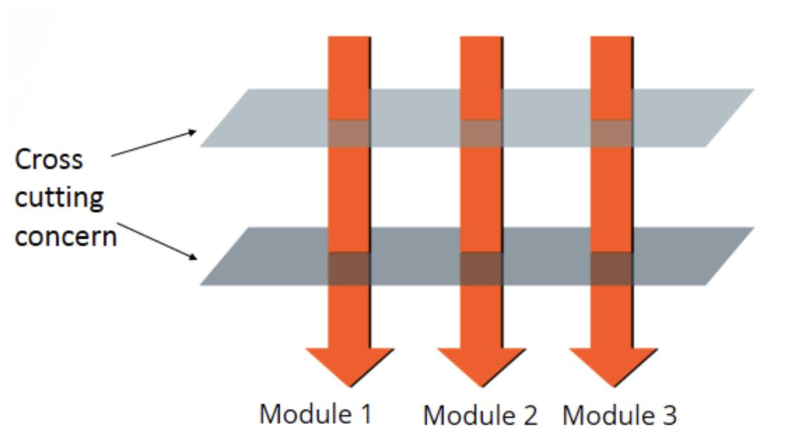

# 11장 시스템

## 도시를 세운다면?
도시를 건설하고, 관리하는데 한 사람으로는 불가능하다. 그래도 도시는 잘 돌아간다. 
그 이유는 수도,전력,교통 등의 요소는 관리팀을 모듈화하고, 각 모듈화 된 팀들은 도시의 전체적인 이해 없이도 추상화를 통해, 도시는 돌아간다.

소프트웨어도 비슷하게 구성되지만, 도시처럼 관심사 분리나, 추상화를 이루지 못하는 경우가 많다.
클린코드를 통해 높은 추상화 수준에서 관심사를 분리할 수 있다.


## 시스템 생성과 시스템 사용을 분리하라! 
- 생성 과 사용은 아주 다르다, 
- 소프트웨어 시스템은 
(애플리케이션 객체를 제작하고, 의존성을 서로 연결하는) 준비과정과
( 준비 과정 이후에 이어지는 ) 런타임 로직을 분리해야한다.
- 시작 단계는 모든 어플리케이션이 풀어야할 관심사이다.
관심사 분리는 가장 오래되고, 중요한 설계 기법중 하나이다. 

- 초기화 지연 / 계산 지연이라는 기법
```
 public Service getService() {
      if (service == null)
          service = new MyServiceImpl(…); // Good enough default for most cases?
      return service;
  }
```

- 장점: 
	- 시작단계가 아닌, 필요할때, 객체 생성을 하기 때문에 애플리케이션 시작하는 시간이 빨라지고, null을 리턴하지 않는다.
- 단점:
	- 시스템에서 getService 메서드가 MyServiceImpl 객체에 대한 의존성을 가지고 되어, MyServiceImpl의 사용여부와 상관없이, 의존성여부를 해결하지 않으면 컴파일에 실패한다.
	- 테스트 수행에도 문제가 발생한다. 만약, MyServiceImpl가 무거운 객체라면 테스트 수행을 위해 테스트 전용 개체나 목업 객체를 service에 할당해야한다.
	일반 런타임 로직에 객체 생성 로직을 섞어 놓은 탓에,  모든 경우의수 ( service = null or !=null )를 테스트 해야한다.
	- 또 MyServiceImpl 객체가 모든 경우에 적절한지에 대해서도 의문이다. 그렇다고 getService() 메서드를 포함하는 클래스가 전체 문맥을 알 필요 또한 없기 때문에, 어떤 객체가 필요한지에 대해서는 알수가 없다
		
### Main 분리 
- 시스템 생성과 시스템 사용을 분리하는 방법중 하나
- 생성과 관련된 코드는 모두 main이나, main에서 호출하는 모듈로 이동 후, 나머지 시스템/애플리케이션은 모든 객체가 생성되었고, 의존성이 연결되었다고 가정한다.


Application은 Main이나, 객체 생성되는 과정은 전혀 모른다. 단지 적절한 객체가 생성 되었다고만 알고있다.

### 팩토리
- 객체의 생성 시점을 애플리케이션에서 결정해야할때는,  Abstract Factory 패턴을 사용한다.

- 마찬가지로 애플리케이션은 LineItem이 어떻게 생성되었는지에 대해서는 구체적으로 알지 못한다.  

### 의존성 주입
- 사용과 제작을 분리하는 강력한 매커니즘 하나가 의존성 주입이다. 의존성 주입은 제어 역전 기법을 의존성관리에 적용한 매커니즘이다. 
- 제어 역전에서는 한객체가 맡은 보조 책임을 새로운 객체에게 전적으로 넘긴다. 새로운 객체는 넘겨받은 책임만 맡기때문에 단일 책임 원칙을 지킬수 있고, 
- 의존성 관리 관점에서는 객체는 의존성 자체를 인스턴스로 만드는 책임을 지지 않는다.
즉, 자신의 의존성을 직접 생성하지 않고, 다른 전담 매커니즘에게  제어를 역전한다. 
```
MyService myService = (MyService (jndiContext.lookup(“NameOfMyService”));
```
 
-> 코드를 호출하는 쪽에서는 실제 lookup 메서드가 어떤 구현체를 리턴하는지 관여하지 않기 때문에, 의존성 문제를 해결할수 있다.
- 진정한 의존성 주입은 클래스가 위 코드처럼 의존성을 해결하려고 시도하지 않고, 의존성 주입 방법으로 생성자 메서드나 setter를 통해 제공한다.
DI 컨테이너는 필요한 객체의 인스턴스를 만든후, 생성자 인수나 setter를 통해 의존성을 부여한다. 
ex> 
```
class AnalyticsAdapter @Inject constructor(
  private val service: AnalyticsService
) { … }
```


## 확장
촌락에서 마을로, 마을에서 도시로 성장한다. 마을의 성장을 고려해서 처음부터 6차선 도로를 만들 순 없다. 
처음부터 시스템을 제대로 만들순 없다.  항상 새로운 스토리에 맞춰 시스템을 조정하고 확장하는 점진적 애자일 방식을 사용한다. 

- TDD(테스트 주도 개발)과 리펙터링으로 얻어지는 클린 코드는 코드 수준에서 시스템을 조정하고 확장하기 쉽게 만든다.
- 관심사를 적절히 분리해 관리한다면 소프트웨어 아키텍처는 점진적으로 발전할 수 있다.

관심사를 분리하지 않고, 확장을 고려하지 않은 구조 
- EJB1, EJB2 (Enterprise Java Bean)- 컨테이너내의 자바 객체를 컴포넌트화 (기술을 많이 넣느냐 관심사를 분리하지 못한 케이스 )
```
public interface BankLocal extends java.ejb.EJBLocalObject {
    String getStreetAddr1() throws EJBException;
    String getStreetAddr2() throws EJBException;
    String getCity() throws EJBException;
    String getState() throws EJBException;
    String getZipCode() throws EJBException;
    void setStreetAddr1(String street1) throws EJBException;
    void setStreetAddr2(String street2) throws EJBException;
    void setCity(String city) throws EJBException;
    void setState(String state) throws EJBException;
    void setZipCode(String zip) throws EJBException;
    Collection getAccounts() throws EJBException;
    void setAccounts(Collection accounts) throws EJBException;
    void addAccount(AccountDTO accountDTO) throws EJBException;
}
```

```
public abstract class Bank implements javax.ejb.EntityBean {
    // 비즈니스 로직
    public abstract String getStreetAddr1();
    public abstract String getStreetAddr2();
    public abstract String getCity();
    public abstract String getState();
    public abstract String getZipCode();
    public abstract void setStreetAddr1(String street1);
    public abstract void setStreetAddr2(String street2);
    public abstract void setCity(String city);
    public abstract void setState(String state);
    public abstract void setZipCode(String zip);
    public abstract Collection getAccounts();
    public abstract void setAccounts(Collection accounts);
    
    public void addAccount(AccountDTO accountDTO) {
        InitialContext context = new InitialContext();
        AccountHomeLocal accountHome = context.lookup(“AccountHomeLocal”);
        AccountLocal account = accountHome.create(accountDTO);
        Collection accounts = getAccounts();
        accounts.add(account);
    }
    
    // EJB 컨테이너 
    public abstract void setId(Integer id);
    public abstract Integer getId();
    public Integer ejbCreate(Integer id) { … }
    public void ejbPostCreate(Integer id) { … }
    
    // 기타 생명주기에 대한 메서드
    public void setEntityContext(EntityContext ctx) {}
    public void unsetEntityContext() {}
    public void ejbActivate() {}
    public void ejbPassivate() {}
    public void ejbLoad() {}
    public void ejbStore() {}
    public void ejbRemove() {}
}
```

- 비즈니스 로직이 EJB2 컨테이너와 강하게 결합되어있어, 클래스 생성할때 컨테이너에서 만들어져야하며, 요구하는 다양한 생명주기 메서드를 제공해야한다 ( ejbActivate(), ejbPassivate(), ejbLoad(), ejbStore(), ejbRemove(),,,,, )
- 비즈니스 로직이 컨테이너와 밀접하게 결합되어 있어, 독자적인 단위테스트가 어렵고, 재활용하기가 사실상 불가능하다. 
- OOP 개념이 무너진다. 빈은 다른 빈을 상속받지 못한다. 불필요한 DTO를 중복으로 만들어야된다.

### 횡단(cross-cutting) 관심사
‘영속성과 같은 관심사는 전반적으로 동일한 방식으로 구성되어야한다.’

원론적으로는 모듈화되고, 캡슐화된 방식으로 영속성 방식을 구현할 수 있지만,

현실적으로는 영속성 방식의 코드가 온갖 객체에서 흩어져서 관리된다. 

-> 횡단 관심사  - 횡단 관심사항의 기능들을 모듈화하고, 중요한 관심사에 대해서 집중적으로 관리할 수 있도록 한다.



모듈 구성 개념인 관점은
특정 관심사를 지원하기 위해 시스템에서 특정 지점들이 동작하는 방식을 일관성 있게 해야한다.

Ex > 영속성의 경우, 저장할 객체와 속성을 선언한 후 영속성 책임을 영속성 프레임워크에게 위임한다. 

자바에서 사용하는 관점 or 관점과 유사한 매커니즘 3개 
### 자바 프록시 
### 순수 자바 AOP 프로그래밍
### AspectJ 관점

## 테스트 주도 시스템 아키텍쳐
- 애플리케이션 도메인 논리를 POJO로 작성한다면 , 즉 코드 수준에서 아키텍쳐와 분리가 가능하다면 진정한 테스트 주도 아키텍쳐 구축이 가능하다.
-  변경에 따라 그때그때 새로운 기술을 채택해 점진적으로 개발할수 있다. 

::최선의 시스템 구조는 각기 POJO 객체로 구현되는 모듈화된 관심사 영역(도메인)으로 구성된다. 
이렇게 서로 다른 영역은 해당 영역 코드에 최소한의 영향을 미치는 관점이나 유사한 도구를 사용해 통합한다.
이런 구조 역시 코드와 마찬가지로 테스트 주도 기법을 적용할수 있다.::

(Plain Old Java Object : 자바언어 이외의 다른 API가 없는 자바오브젝트를 의미함 )

## 의사결정을 최적화하라
- 모듈을 나누고 관심사를 분리하면, 지엽적인 관리와 결정이 가능해진다. 
도시는 시스템이든 한사람이 모든 결정을 내리긴 어렵기 때문에, 가장 적합한 사람에게 책임을 맡기는게 좋다. 
- 최대한 정보를 모아 최선의 결정을 내리기 위해, 결정은 가능한 마지막 순간까지 미루는 방법이 좋다. 
- ( 관심사를 모듈로 분리한 POJO 시스템은 변화에 대한 기민함을 제공하기때문에, 최신의 데이터로 최적의 선택을 할수 있도록 도와주고, 결정의 복잡성도 줄어든다 )

## 명백한 가치가 있을 때 표준을 현명하게 사용하라
많은 팀들이 더 좋은 설계를 할 수 있엇지만, 표준이라는 이유만으로 EJB2를 사용했다. 
:: 표준을 사용하면 아이디어와 컴포넌트를 재활용하기 쉽고, 적절한 경험을 가진 사람을 구하기 쉬우며, 좋은 아이디어를 캡슐화하기 쉽고, 컴포넌트를 엮기 쉽다
하지만 때로는 표준을 만드는 시간이 너무 오래걸려 업계가 기다리지 못한다
어떤 표준은 기존 표준을 제정한 목적을 잃어버리기도 한다.::

## 시스템은 도메인 특화 언어가 필요하다.
좋은 DSL은 도메인 영역의 개념과 실제 구현될 코드 사이의 소통의 간극을 줄여 도메인 영역을 코드 구현으로 번역하는 데에 오역을 줄여준다. 
DSL을 효율적으로 사용하면 코드 덩어리와 디자인 패턴의 추상도를 높여 주며 그에 따라 코드의 의도를 적절한 추상화레벨에서 표현할 수 있게 해준다.

- DSL은 “모든 단계에서의 추상화”와 “모든 도메인의 POJO화”를 고차원적 규칙과 저차원적 디테일 전반에 걸쳐 도와 준다.

## 결론 
깨끗하지 못한 아키텍쳐는 도메인 논리를 흐리며 기민성을 떨어트린다.
도메인 논리가 흐려지면, 버그가 잦아지고, 스토리를 구현하기 어려워져, 품질이 낮아진다.
기민성이 떨어지면, 생산성이 낮아져 TDD의 장점이 사라진다.

클린코드를 위해서, 모든 추상화단계에서 의도는 명확해야하며, 
POJO를 작성 하고, 관점지향등의 매커니즘을 통해 관심사를 분리해야한다.
